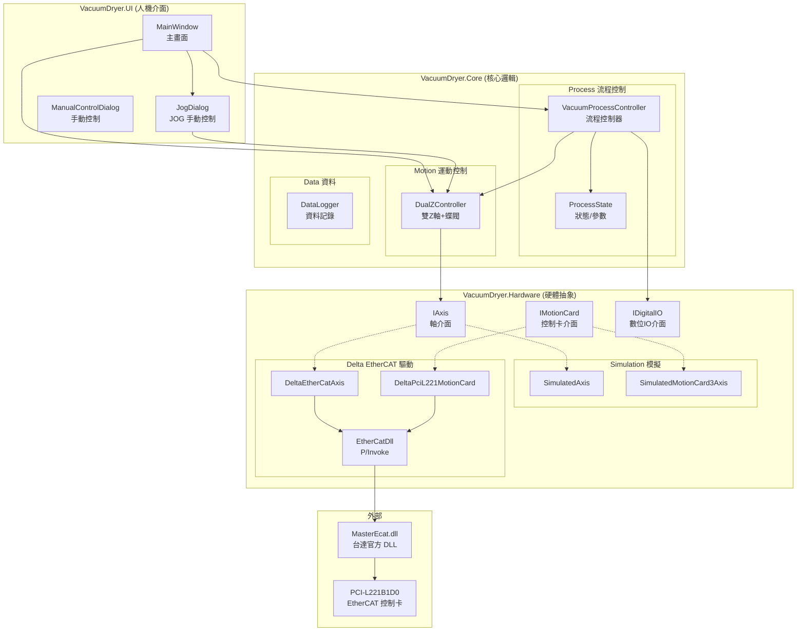
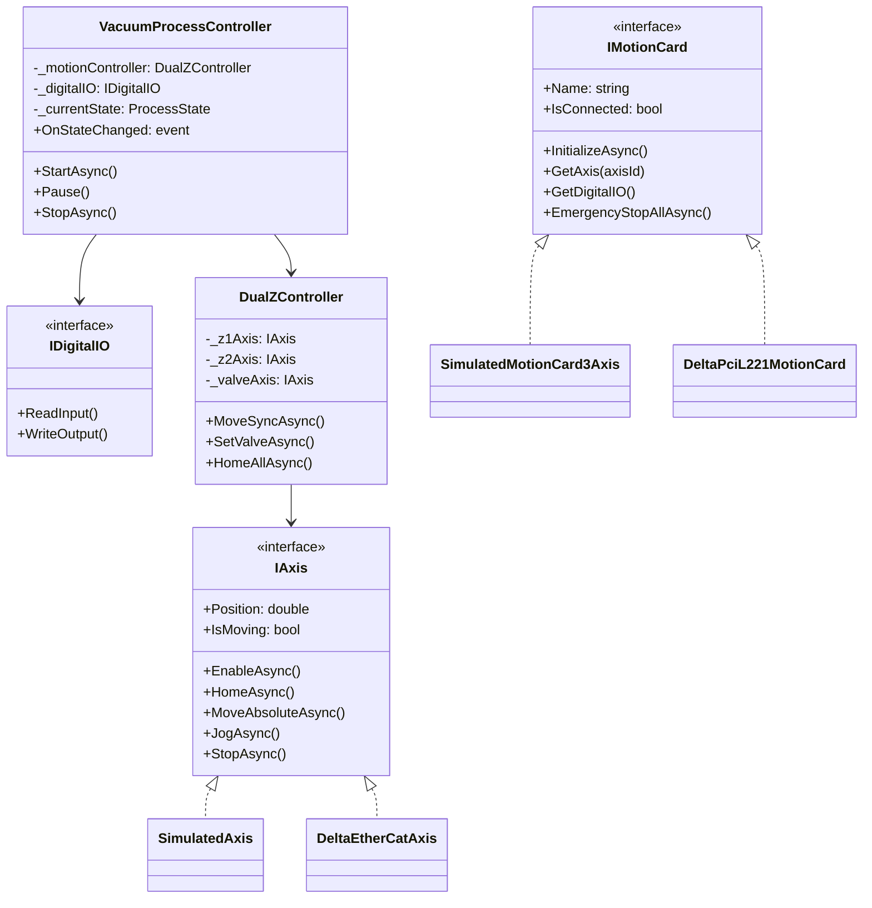
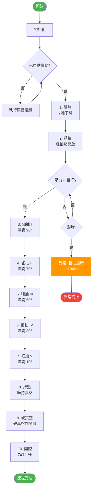
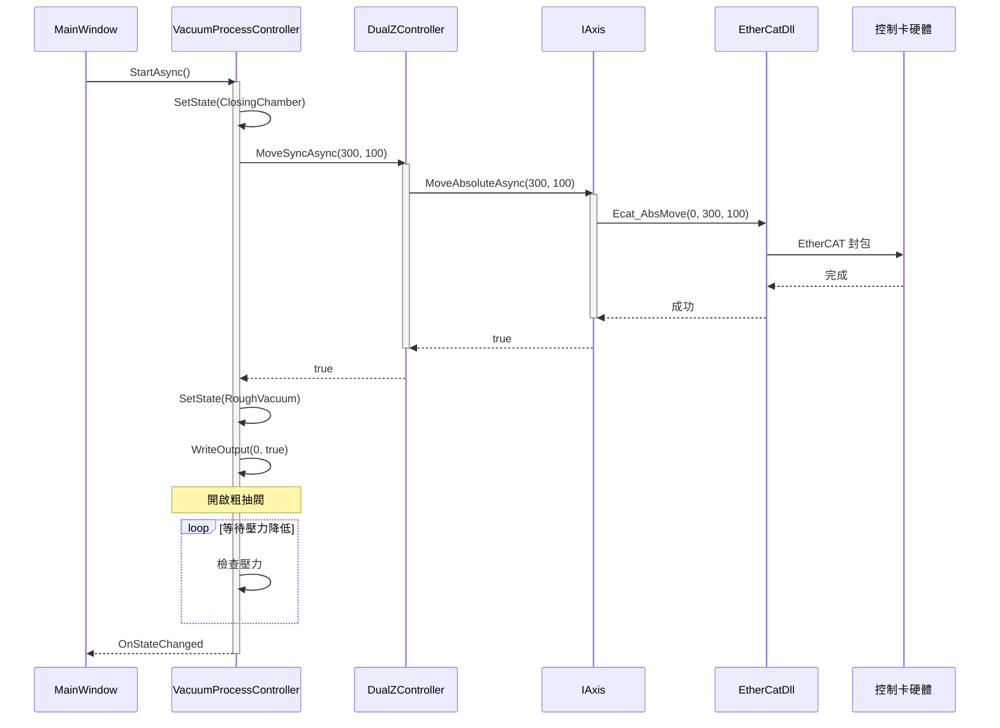

# VacuumDryer 系統架構圖

> 最後更新: 2026-02-09

---

## 軟體架構圖



---

## 類別關係圖



---

## VCD 真空乾燥流程圖



---

## 指令下達流程



---

## IO 通道定義

| DO 通道 | 功能 | 說明 |
|---------|------|------|
| 0 | 粗抽閥 | 粗抽階段開啟 |
| 1 | 細抽閥 | 細抽階段開啟 |
| 2 | 破真空小閥 | 破真空初期開啟 |
| 3 | 破真空大閥 | 破真空加速開啟 |

| 軸號 | 名稱 | 功能 |
|------|------|------|
| 0 | Z1 | 龍門左側 Z 軸 |
| 1 | Z2 | 龍門右側 Z 軸 |
| 2 | Valve | 蝶閥控制軸 |

---

## 檔案結構

```
d:\git\VacuumDryer\
├── VacuumDryer.sln
│
├── VacuumDryer.Core\              # 核心邏輯層
│   ├── Motion\
│   │   └── DualZController.cs     # 雙Z軸控制器
│   ├── Process\
│   │   ├── ProcessState.cs        # 流程狀態/參數
│   │   └── VacuumProcessController.cs  # 流程控制器
│   └── Data\
│       └── DataLogger.cs          # 資料記錄
│
├── VacuumDryer.Hardware\          # 硬體抽象層
│   ├── IAxis.cs                   # 軸介面
│   ├── IMotionCard.cs             # 控制卡介面
│   ├── IDigitalIO.cs              # 數位IO介面
│   ├── Simulation\                # 模擬實作
│   │   ├── SimulatedAxis.cs
│   │   └── SimulatedMotionCard3Axis.cs
│   └── Delta\                     # 台達驅動
│       ├── EtherCatDll.cs         # P/Invoke
│       ├── DeltaEtherCatAxis.cs
│       └── DeltaPciL221MotionCard.cs
│
└── VacuumDryer.UI\                # 人機介面層
    ├── App.xaml
    └── Views\
        ├── MainWindow.xaml        # 主畫面
        ├── JogDialog.xaml         # JOG 對話框
        └── ManualControlDialog.xaml
```
