# VacuumDryer 系統架構圖

> 最後更新: 2026-02-10

---

## 軟體架構圖

```mermaid
graph TB
    subgraph UI["VacuumDryer.UI (人機介面)"]
        MainWindow["MainWindow<br/>主畫面"]
        JogDialog["JogDialog<br/>JOG 手動控制"]
        ManualDialog["ManualControlDialog<br/>手動控制"]
    end
    
    subgraph Core["VacuumDryer.Core (核心邏輯)"]
        subgraph EngineLayer["Engine 通用流程引擎"]
            PE["ProcessEngine<br/>主迴圈 + DFS"]
            IPS["IProcessStep<br/>步驟插件介面"]
            IPC["IProcessContext<br/>環境介面"]
            PN["ProcessNode<br/>樹節點"]
            PE --> PN
            PE --> IPC
            PN --> IPS
        end
        
        subgraph Process["Process 流程控制"]
            VPC["VacuumProcessController<br/>流程控制器"]
            VCtx["VacuumProcessContext<br/>IProcessContext 實作"]
            PS["ProcessState / Recipe<br/>狀態/參數"]
        end
        
        subgraph Steps["Steps 步驟插件"]
            S1["CloseChamberStep"]
            S2["RoughVacuumStep"]
            S3["HighVacuumStep x5"]
            S4["HoldPressureStep"]
            S5["VacuumBreakStep"]
            S6["OpenChamberStep"]
        end
        
        subgraph Motion["Motion 運動控制"]
            DZC["DualZController<br/>雙Z軸+蝶閥"]
        end
        
        subgraph Data["Data 資料"]
            DL["DataLogger<br/>資料記錄"]
        end
    end
    
    subgraph Hardware["VacuumDryer.Hardware (硬體抽象)"]
        IAxis["IAxis<br/>軸介面"]
        IMotionCard["IMotionCard<br/>控制卡介面"]
        IDigitalIO["IDigitalIO<br/>數位IO介面"]
        
        subgraph Simulation["Simulation 模擬"]
            SimAxis["SimulatedAxis"]
            SimCard["SimulatedMotionCard3Axis"]
        end
        
        subgraph Delta["Delta EtherCAT 驅動"]
            DeltaAxis["DeltaEtherCatAxis"]
            DeltaCard["DeltaPciL221MotionCard"]
            EcatDll["EtherCatDll<br/>P/Invoke"]
        end
    end
    
    subgraph External["外部"]
        DLL["MasterEcat.dll<br/>台達官方 DLL"]
        HW["PCI-L221B1D0<br/>EtherCAT 控制卡"]
    end
    
    MainWindow --> VPC
    MainWindow --> DZC
    MainWindow --> JogDialog
    JogDialog --> DZC
    
    VPC --> PE
    VPC --> VCtx
    VCtx --> PS
    VCtx -.-> DZC
    VCtx -.-> IDigitalIO
    
    S1 -.-> IPS
    S2 -.-> IPS
    S3 -.-> IPS
    S4 -.-> IPS
    S5 -.-> IPS
    S6 -.-> IPS
    
    DZC --> IAxis
    
    IAxis -.-> SimAxis
    IAxis -.-> DeltaAxis
    IMotionCard -.-> SimCard
    IMotionCard -.-> DeltaCard
    
    DeltaAxis --> EcatDll
    DeltaCard --> EcatDll
    EcatDll --> DLL
    DLL --> HW
```



---

## ProcessEngine 框架架構


---

## 流程樹結構

```mermaid
flowchart TD
    Root["Root"] --> CC["CloseChamber<br/>關腔"]
    CC --> RV["RoughVacuum<br/>粗抽"]
    RV --> HV1["HighVacuum1<br/>細抽 I 蝶閥90°"]
    HV1 --> HV2["HighVacuum2<br/>細抽 II 蝶閥70°"]
    HV2 --> HV3["HighVacuum3<br/>細抽 III 蝶閥50°"]
    HV3 --> HV4["HighVacuum4<br/>細抽 IV 蝶閥30°"]
    HV4 --> HV5["HighVacuum5<br/>細抽 V 蝶閥10°"]
    HV5 --> HP["HoldPressure<br/>持壓"]
    HP --> VB["VacuumBreak<br/>破真空"]
    VB --> OC["OpenChamber<br/>開腔"]
    OC --> Done(["Complete"])
    
    style Root fill:#607D8B,color:white
    style Done fill:#4CAF50,color:white
```



---

## 指令下達流程

```mermaid
sequenceDiagram
    participant UI as MainWindow
    participant VPC as VacuumProcessController
    participant PE as ProcessEngine
    participant Step as IProcessStep
    participant Ctx as VacuumProcessContext
    participant DZ as DualZController
    participant HW as 控制卡硬體
    
    UI->>VPC: StartAsync()
    VPC->>PE: RunAsync(context)
    activate PE
    
    PE->>PE: FindNextStep(root)
    PE->>Step: ExecuteAsync(context, ct)
    activate Step
    
    Step->>Ctx: GetService<DualZController>()
    Ctx-->>Step: DualZController
    Step->>DZ: MoveSyncAsync(300, 100)
    DZ->>HW: EtherCAT 封包
    HW-->>DZ: 完成
    DZ-->>Step: true
    
    deactivate Step
    Step-->>PE: 完成
    PE->>PE: MarkComplete(flags["CloseChamber"] = true)
    PE->>PE: FindNextStep → 下一步
    
    Note over PE: 迴圈直到所有步驟完成
    
    PE-->>VPC: true
    deactivate PE
    VPC-->>UI: OnStateChanged
```



---

## IO 通道定義

| DO 通道 | 功能 | 說明 |
|---------|------|------|
| 0 | 粗抽閥 | 粗抽階段開啟 |
| 1 | 細抽閥 | 細抽階段開啟 |
| 2 | 破真空小閥 | 破真空初期開啟 |
| 3 | 破真空大閥 | 破真空加速開啟 |

| 軸號 | 名稱 | 功能 |
|------|------|------|
| 0 | Z1 | 龍門左側 Z 軸 |
| 1 | Z2 | 龍門右側 Z 軸 |
| 2 | Valve | 蝶閥控制軸 |

---

## 檔案結構

```
d:\git\VacuumDryer\
├── VacuumDryer.sln
│
├── VacuumDryer.Core\              # 核心邏輯層
│   ├── Motion\
│   │   └── DualZController.cs     # 雙Z軸控制器
│   ├── Process\
│   │   ├── Engine\                # 📦 通用流程引擎 (可複用)
│   │   │   ├── IProcessStep.cs    # 步驟插件介面
│   │   │   ├── IProcessContext.cs # 環境介面
│   │   │   ├── ProcessNode.cs     # 樹狀節點
│   │   │   └── ProcessEngine.cs   # 流程引擎
│   │   ├── Steps\                 # VacuumDryer 步驟插件
│   │   │   └── VacuumSteps.cs     # 6 個 IProcessStep
│   │   ├── ProcessState.cs        # 狀態 enum / Recipe
│   │   ├── ProcessFlags.cs        # 旗標結構
│   │   ├── VacuumProcessContext.cs # IProcessContext 實作
│   │   └── VacuumProcessController.cs  # 流程控制器
│   └── Data\
│       └── DataLogger.cs          # 資料記錄
│
├── VacuumDryer.Hardware\          # 硬體抽象層
│   ├── IAxis.cs                   # 軸介面
│   ├── IMotionCard.cs             # 控制卡介面
│   ├── IDigitalIO.cs              # 數位IO介面
│   ├── Simulation\                # 模擬實作
│   │   ├── SimulatedAxis.cs
│   │   └── SimulatedMotionCard3Axis.cs
│   └── Delta\                     # 台達驅動
│       ├── EtherCatDll.cs         # P/Invoke
│       ├── DeltaEtherCatAxis.cs
│       └── DeltaPciL221MotionCard.cs
│
└── VacuumDryer.UI\                # 人機介面層
    ├── App.xaml
    └── Views\
        ├── MainWindow.xaml        # 主畫面
        ├── JogDialog.xaml         # JOG 對話框
        └── ManualControlDialog.xaml
```
